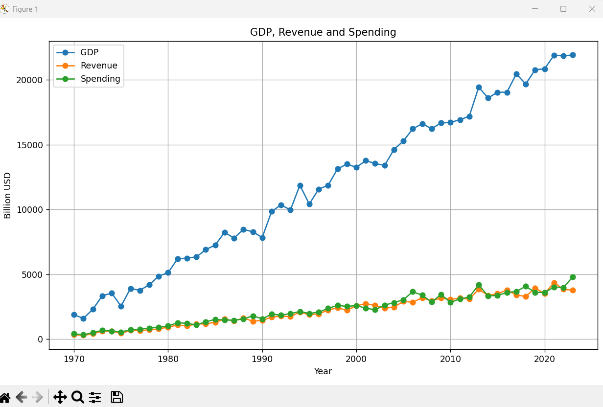

# Fiscal Policy Data Analysis Tool
This project is a menu-driven Python application for analyzing fiscal policy data (1970–2023) using Pandas and Matplotlib.

## Why this project? This project was developed to analyze long-term fiscal trends and understand relationships between government revenue, spending, debt, and macroeconomic indicators. It helps identify fiscal risks, budget imbalances, and inflation-adjusted performance over time.

## Features
- Dataset validation and cleaning
- Revenue and spending growth analysis
- Budget surplus/deficit detection
- Debt-to-GDP risk analysis (≥90%)
- Inflation-adjusted analysis (CPI-based)
- Simple trend-based forecast
- Data visualization (line, bar, pie charts)

## Dataset

The dataset contains fiscal indicators from 1970 to 2023, including:

- GDP (Billion USD)
- Government Revenue (Billion USD)
- Government Spending (Billion USD)
- Budget Balance (Billion USD)
- Public Debt (% of GDP)
- Inflation Rate (%)
- Unemployment Rate (%)

## Technologies

- Python
- Pandas
- Matplotlib
- CSV

## How to Run
1. Install requirements:
  pip install -r requirements.txt
2. Run:
   python main.py
3. Choose options from the menu.

## Project Structure

.
├── main.py
├── fiscal_policy_extended_1970_2023.csv
├── README.md
├── requirements.txt
├── image_revenue.png
├── budget_balance_analysis.png
├── Debt-to-GDP-Analysis.png
├── correlation-analysis.png
├── revenue_changes.png
├── forecast.png

## Screenshots

### Revenue vs Spending

### Budget Balance Analysis

### Debt to GDP Analysis
 

### Fiscal correlation analysis

### Sharp Revenue/Spending Changes

###  Forecast Revenue & Expenditure

