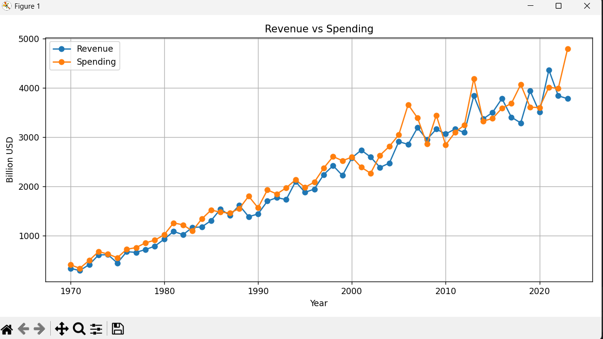
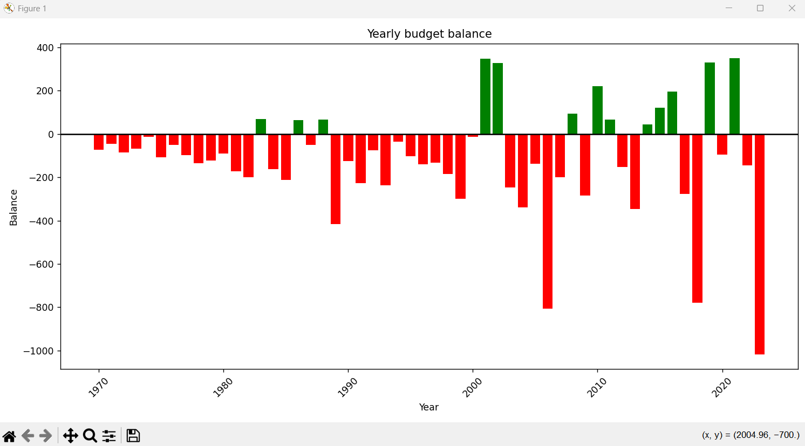
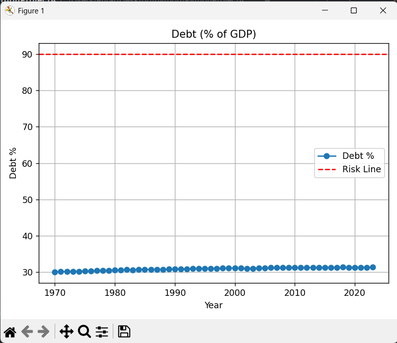
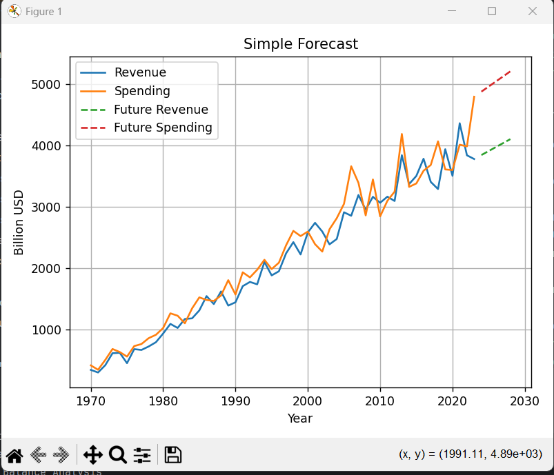
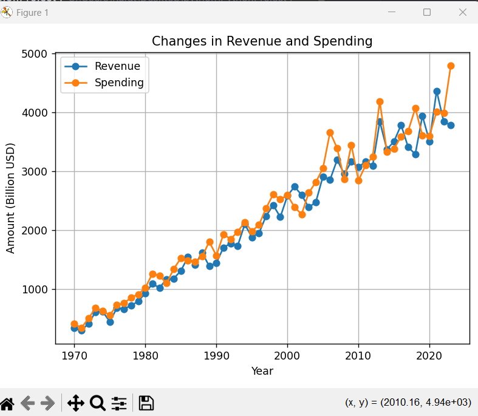

# Fiscal Policy Data Analysis Tool
This project is a menu-driven Python application for analyzing fiscal policy data (1970–2023) using Pandas and Matplotlib.

## Features
- Dataset validation and cleaning
- Revenue and spending growth analysis
- Budget surplus/deficit detection
- Debt-to-GDP risk analysis (≥90%)
- Inflation-adjusted analysis (CPI-based)
- Simple trend-based forecast
- Data visualization (line, bar, pie charts)

## Technologies
Python, Pandas, Matplotlib, CSV

## How to Run
1. Install requirements:
   pip install pandas matplotlib
2. Run:
   python main.py
3. Choose options from the menu.

## Screenshots

### Revenue vs Spending

### Budget Balance Analysis

### Debt to GDP Analysis
 

###  Forecast Revenue & Expenditure

### Sharp Revenue/Spending Changes

